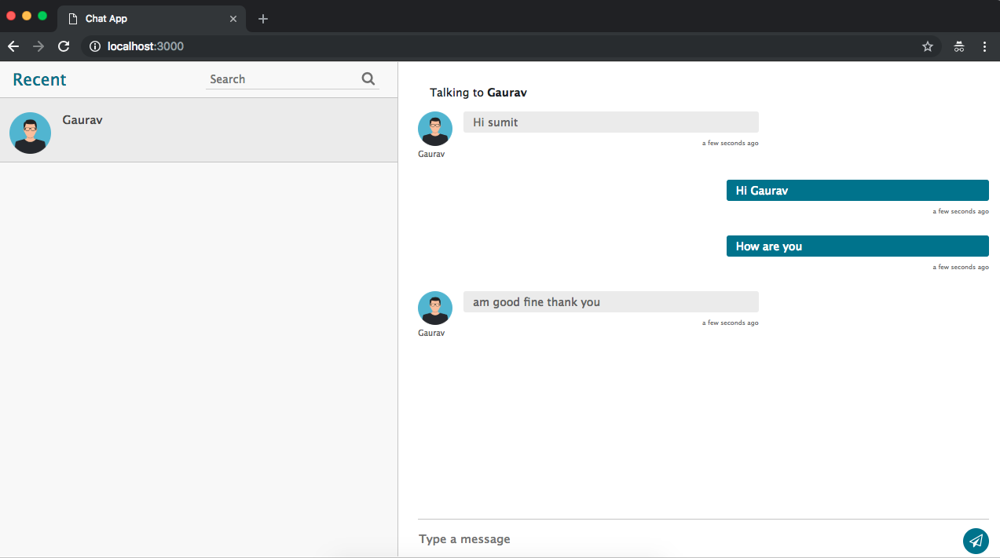
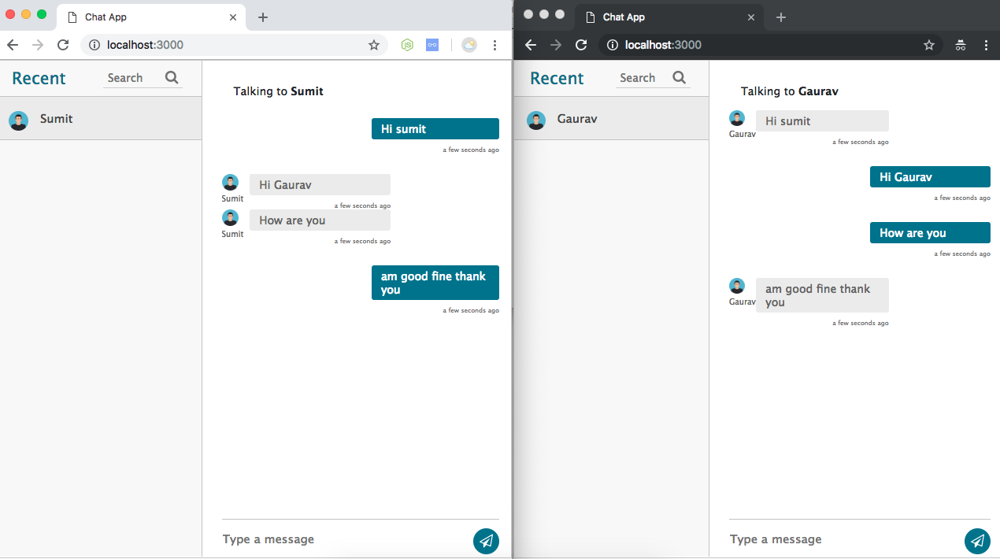

# node-chat-one-to-one
Node socket.io based one to one chat.

## Features
 1. One to one chat 
 2. Chat Rooms
 3. Individual login using passport.
 4. Bootstrap 4 UI
 5. Seperate UI, so you can skin as you want.
 6. Developed with Express.js, EJS, Socket.io

## ToDO List
 1. Block or Ignore user
 2. Make more skins.
 3. Admin panel, so admin can make chat rooms.

## On Demand feature?
 looking for some custom feature with this script, feel free to open an issue at github, with feature request.

## License
 It comes with MIT license, means you can use it as you want.

## Special thanks
1. Sumit rajput, for making beautiful ui for chat screen. 
